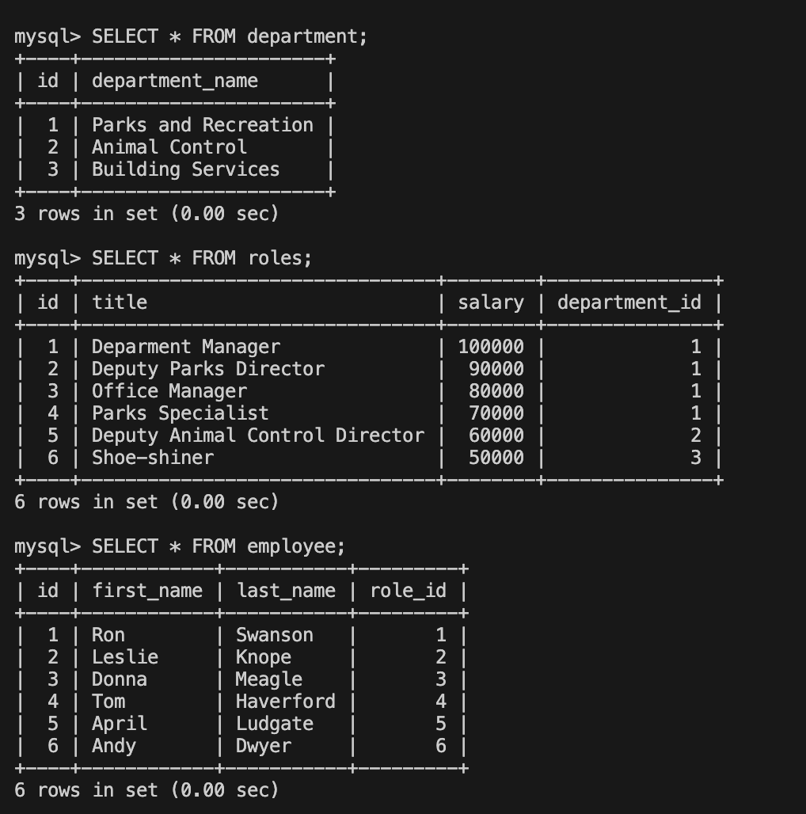

<h1 align="center">Employee Tracker </h1>

  
  
  
 
  
  
  
  
  

## Description 📚

- What was your motivation? Why did you build this project? What problem does it solve? What did you learn?

This project is built to hold information in database/s format. The information held concerns the employees information including name, role, salary, title etc. The employee information is able to interact using mySQL tables.

## Table of Contents 

- [User-Story](#user-story)
- [Acceptance-Criteria](#acceptance-criteria)
- [Installation](#installation-📋)
- [Usage](#usage-🏁)
- [Demonstration](#demonstration)
- [Author](#author-👋🏽)

## User Story

AS A small business owner
I WANT to be able to write and save notes
SO THAT I can organize my thoughts and keep track of tasks I need to complete

## Acceptance Criteria

GIVEN a command-line application that accepts user input:

- WHEN I start the application THEN I am presented with the following options: view all departments, view all roles, view all employees, add a department, add a role, add an employee, and update an employee role
- WHEN I choose to view all departments THEN I am presented with a formatted table showing department names and department ids
- WHEN I choose to view all roles THEN I am presented with the job title, role id, the department that role belongs to, and the salary for that role
- WHEN I choose to view all employees THEN I am presented with a formatted table showing employee data, including employee ids, first names, last names, job titles, departments, salaries, and managers that the employees report to
- WHEN I choose to add a department THEN I am prompted to enter the name of the department and that department is added to the database
- WHEN I choose to add a role THEN I am prompted to enter the name, salary, and department for the role and that role is added to the database
- WHEN I choose to add an employee THEN I am prompted to enter the employee’s first name, last name, role, and manager, and that employee is added to the database
- WHEN I choose to update an employee role THEN I am prompted to select an employee to update and their new role and this information is updated in the database

## Installation 📋

- What are the steps required to install your project? Provide a step-by-step description of how to get the development environment running.

This application will be installed by running the following command in the integrated terminal: `npm install`
Once the dependencies are installed, you can log into mySql using the `mysql -u root -p` in the Develop terminal. Once you are logged into the terminal, the user needs to set up the database in mysql by running the two mysql files with these two commands from the Develop integrated terminal: `SOURCE db/schema.sql` and `SOURCE db/seeds.sql`. Running the schema will create the cms_db database. Running the seeds will create tables and insert data into those tables. 

The user can then interact with the information once the database has been created, tables have been creates and data has been inserted. 

Running `npm start` or `node server.js` will initiate the interaction with the data.

## Usage 🏁

Provide instructions and examples for use.

This can be used to manage all the employee information. The user can view all the departments, roles and employees. They can also create a department and role as well as add a new employee to the database. The user can also update a current employees role.

## Demonstration ✅ 

This is a screenshot of the mysql displaying all three tables and the data. 
 

Click [here]( ) for the youtube video demonstrating the various ways to interact with the database.

## Author 👋🏽

GitHub Username: [schneidsmc](https://github.com/schneidsmc)

📧 Email: schneidsmc@gmail.com

This README was created with ❤️ using README Generator 👏🏽👏🏽

